# UI audit — baseline

Viewport 1100×900 · 2026-08-15T11:56:23.958Z

Reference = `series-winner`. Rule 4.2 requires the three shell distances to be identical
in every game. `root gap` / `max-width` / `align` are the game's OWN root — these differing
is why games look unlike each other even when the shell distances pass.

| game | top | →exit | bottom→ | fits vp | in shell | root gap | max-w | align | children |
|---|---|---|---|---|---|---|---|---|---|
| series-winner | PASS | PASS | PASS | yes | yes | 20px | 560px | normal | 3 |
| name-logo | PASS | PASS | PASS | yes | yes | 20px | 560px | normal | 4 |
| guess-mvps | FAIL (82 vs 28.6) | PASS | FAIL (82 vs 28.6) | yes | yes | 20px | 560px | normal | 4 |
| starting-five | PASS | PASS | PASS | yes | yes | 20px | 720px | center | 3 |
| wordle | PASS | PASS | PASS | yes | yes | 11.7px | none | center | 3 |
| fan-favorites | PASS | PASS | PASS | yes | yes | 14.4px | 560px | center | 4 |
| heatmap | PASS | FAIL (12 vs 28) | PASS | yes | yes | 12px | 560px | center | 3 |
| connections | PASS | FAIL (12 vs 28) | PASS | yes | yes | 12.6px | 560px | center | 4 |
| career-path | PASS | FAIL (12 vs 28) | PASS | yes | yes | 16.2px | 560px | center | 4 |
| nba-grid | PASS | FAIL (12 vs 28) | PASS | yes | yes | 13.5px | 460px | stretch | 4 |
| who-are-ya | PASS | FAIL (12 vs 28) | PASS | yes | yes | 12.6px | 520px | stretch | 3 |
| tictactoe | PASS | FAIL (12 vs 28) | PASS | yes | yes | 14px | 560px | stretch | 3 |
| bingo | PASS | FAIL (12 vs 28) | PASS | yes | yes | 14.4px | 560px | stretch | 4 |
| contexto | PASS | FAIL (12 vs 28) | PASS | yes | yes | 12.6px | 560px | normal | 4 |
| who-would-win | PASS | FAIL (12 vs 28) | PASS | yes | yes | 16.2px | 560px | center | 5 |
| pack-five | PASS | FAIL (12 vs 28) | PASS | yes | yes | 12.6px | 520px | stretch | 5 |
| superdraft | PASS | FAIL (12 vs 28) | PASS | yes | yes | 12px | 480px | normal | 4 |
| imposter | PASS | FAIL (12 vs 28) | PASS | yes | yes | 12px | 430px | normal | 1 |

## Per-game detail

### series-winner
- root: `(inline styles)` — width 560px, gap `20px`, align `normal`
- shell: top 28.6 · game→exit 28 · exit→bottom 28.6
- first child offset: 0 · gaps between children: [20,20]
- 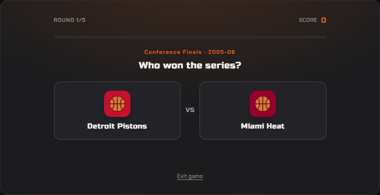
### name-logo
- root: `(inline styles)` — width 560px, gap `20px`, align `normal`
- shell: top 28.6 · game→exit 28 · exit→bottom 28.6
- first child offset: 0 · gaps between children: [20,20,20]
- 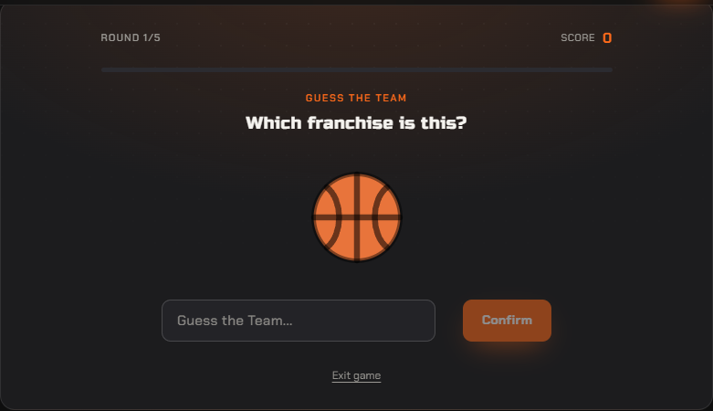
### guess-mvps
- root: `(inline styles)` — width 560px, gap `20px`, align `normal`
- shell: top 82 · game→exit 28 · exit→bottom 82
- first child offset: 0 · gaps between children: [20,20,20]
- 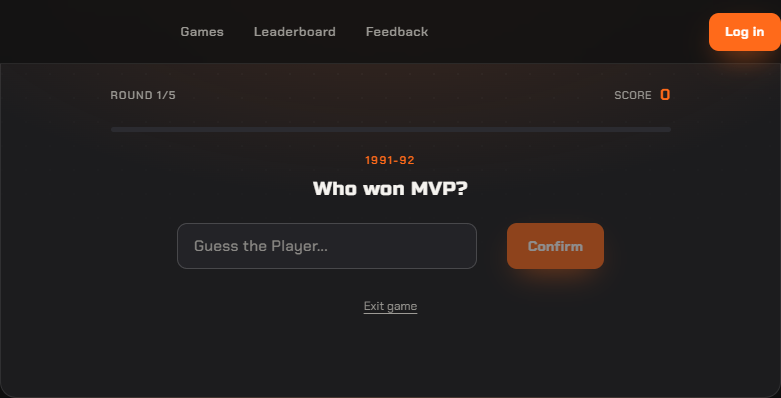
### starting-five
- root: `s5-wrap` — width 720px, gap `20px`, align `center`
- shell: top 28.6 · game→exit 28 · exit→bottom 28.6
- first child offset: 0 · gaps between children: [20,20]
- absolutely-positioned descendants: s5-flip, s5-face s5-face--front, s5-unknown, s5-unknown-q font-display, s5-face s5-face--back, s5-flip
- 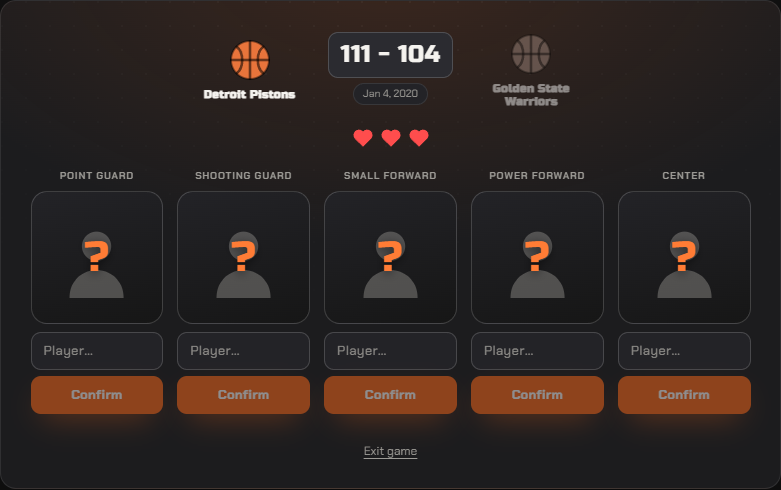
### wordle
- root: `wordle-container` — width 721px, gap `11.7px`, align `center`
- shell: top 28.6 · game→exit 28 · exit→bottom 28.6
- first child offset: 0 · gaps between children: [11.7,11.7]
- 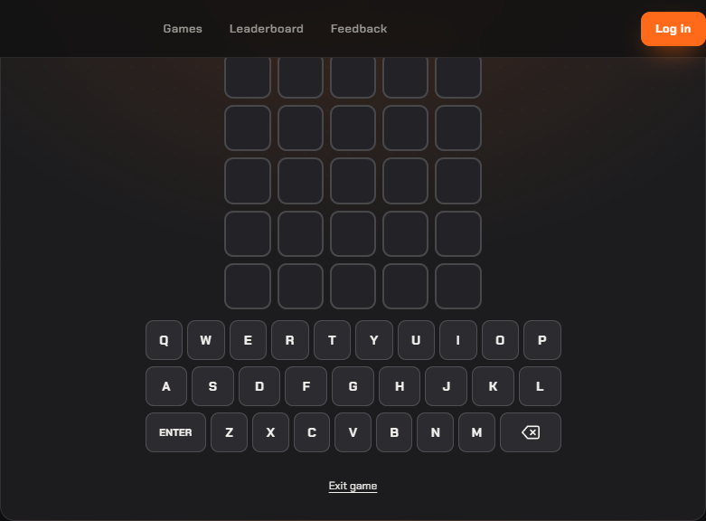
### fan-favorites
- root: `ff-wrap` — width 560px, gap `14.4px`, align `center`
- shell: top 28.6 · game→exit 28 · exit→bottom 28.6
- first child offset: 0 · gaps between children: [14.4,14.4,14.4]
- 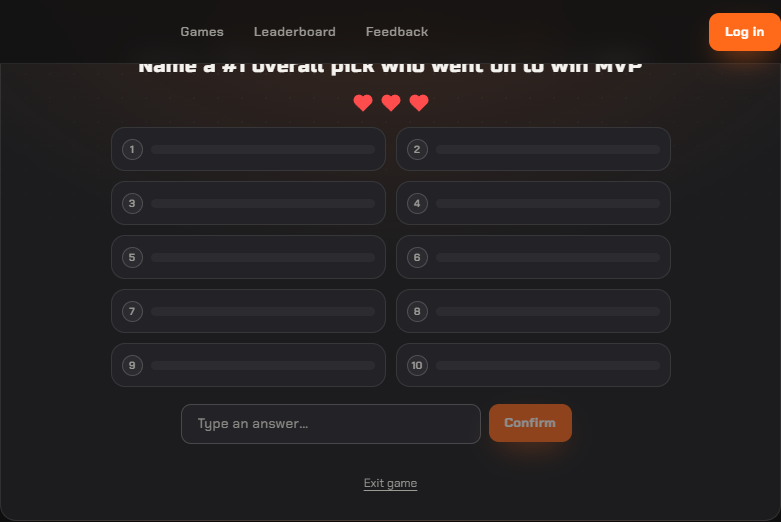
### heatmap
- root: `hm-wrap` — width 560px, gap `12px`, align `center`
- shell: top 28.6 · game→exit 12 · exit→bottom 28.6
- first child offset: 0 · gaps between children: [12,12]
- absolutely-positioned descendants: hm-center
- 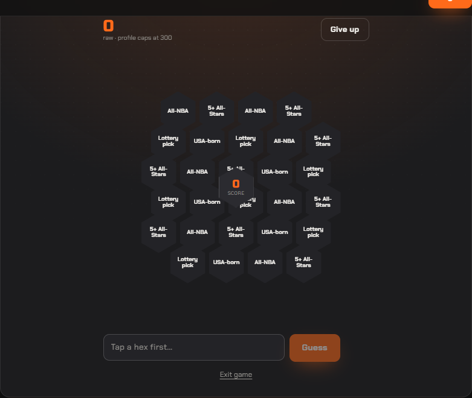
### connections
- root: `cn-wrap` — width 560px, gap `12.6px`, align `center`
- shell: top 28.6 · game→exit 12 · exit→bottom 28.6
- first child offset: 0 · gaps between children: [12.6,12.6,12.6]
- 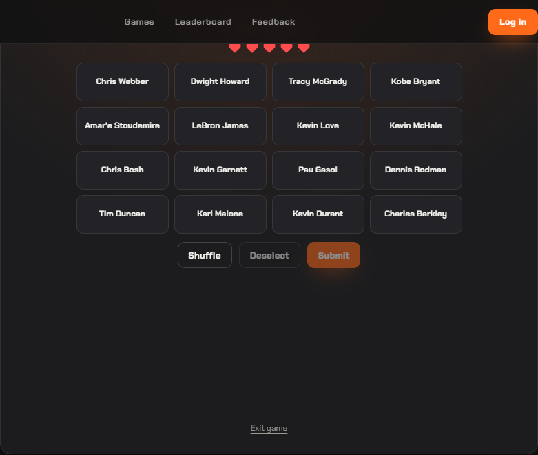
### career-path
- root: `cp-wrap` — width 560px, gap `16.2px`, align `center`
- shell: top 28.6 · game→exit 12 · exit→bottom 28.6
- first child offset: 0 · gaps between children: [16.2,16.2,16.2]
- absolutely-positioned descendants: cp-face cp-face--back, cp-court, cp-face cp-face--front, cp-face cp-face--back, cp-court, cp-face cp-face--front
- 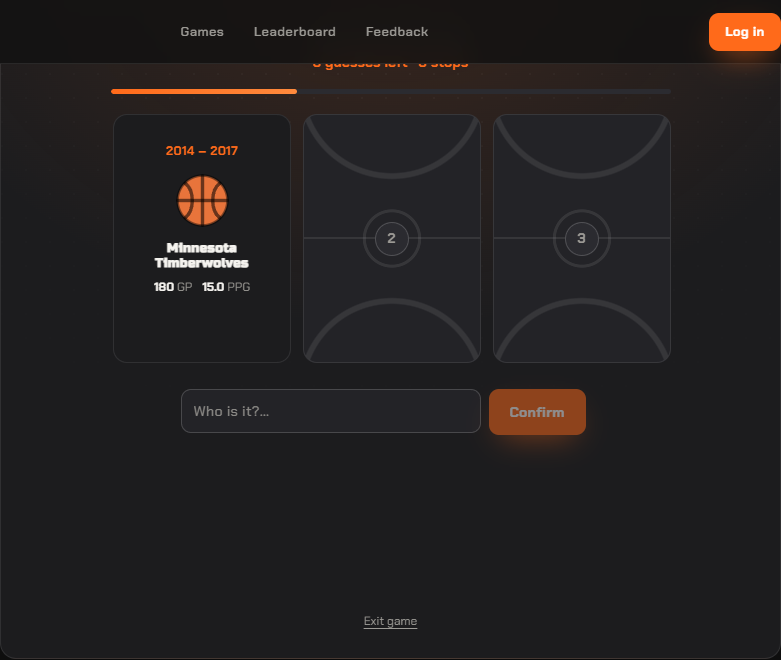
### nba-grid
- root: `ng-wrap` — width 460px, gap `13.5px`, align `stretch`
- shell: top 28.6 · game→exit 12 · exit→bottom 28.6
- first child offset: 0 · gaps between children: [13.5,13.5,13.5]
- 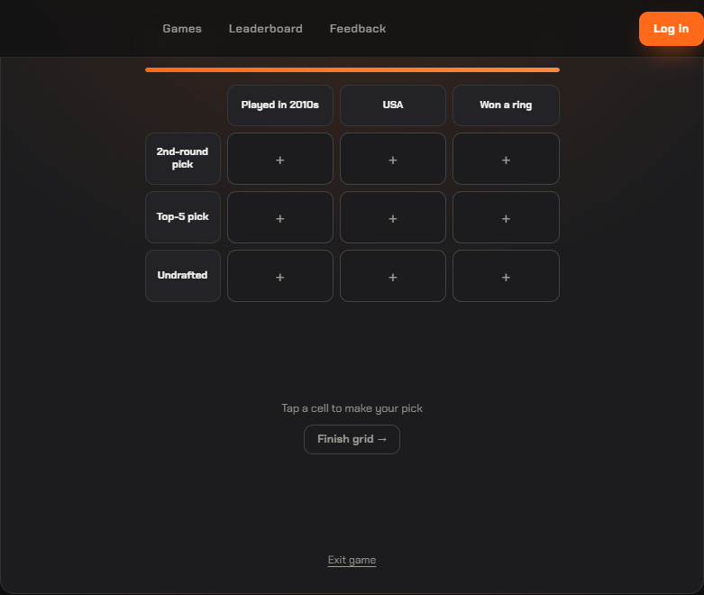
### who-are-ya
- root: `waya-wrap` — width 520px, gap `12.6px`, align `stretch`
- shell: top 28.6 · game→exit 12 · exit→bottom 28.6
- first child offset: 0 · gaps between children: [12.6,12.6]
- 
### tictactoe
- root: `ttt-wrap` — width 560px, gap `14px`, align `stretch`
- shell: top 28.6 · game→exit 12 · exit→bottom 28.6
- first child offset: 0 · gaps between children: [14,14]
- 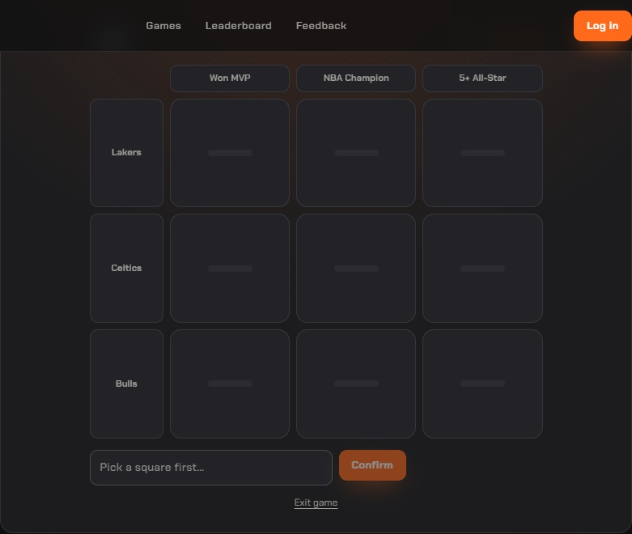
### bingo
- root: `bng-wrap` — width 560px, gap `14.4px`, align `stretch`
- shell: top 28.6 · game→exit 12 · exit→bottom 28.6
- first child offset: 0 · gaps between children: [14.4,14.4,14.4]
- 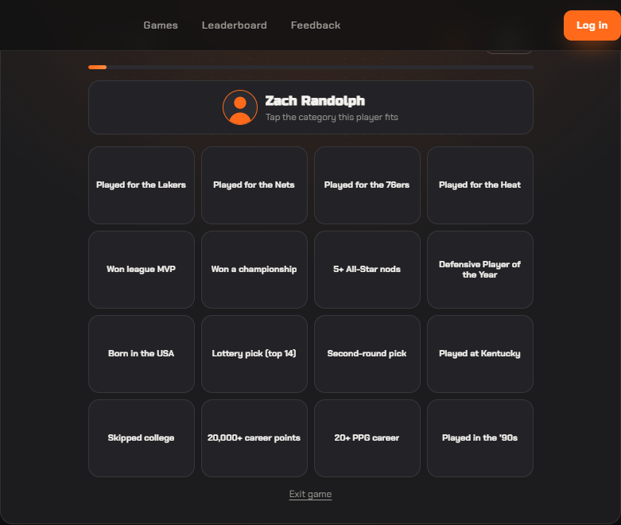
### contexto
- root: `cx-wrap` — width 560px, gap `12.6px`, align `normal`
- shell: top 28.6 · game→exit 12 · exit→bottom 28.6
- first child offset: 0 · gaps between children: [12.6,12.6,12.6]
- 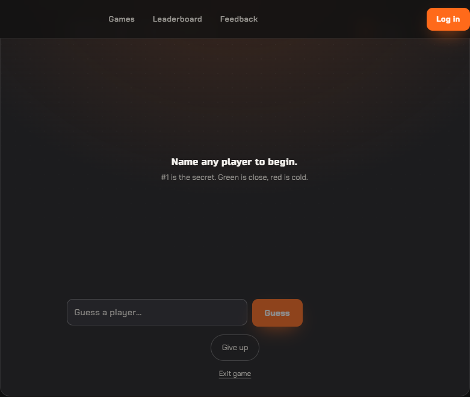
### who-would-win
- root: `www-wrap` — width 560px, gap `16.2px`, align `center`
- shell: top 28.6 · game→exit 12 · exit→bottom 28.6
- first child offset: 0 · gaps between children: [16.2,16.2,16.2,16.2]
- 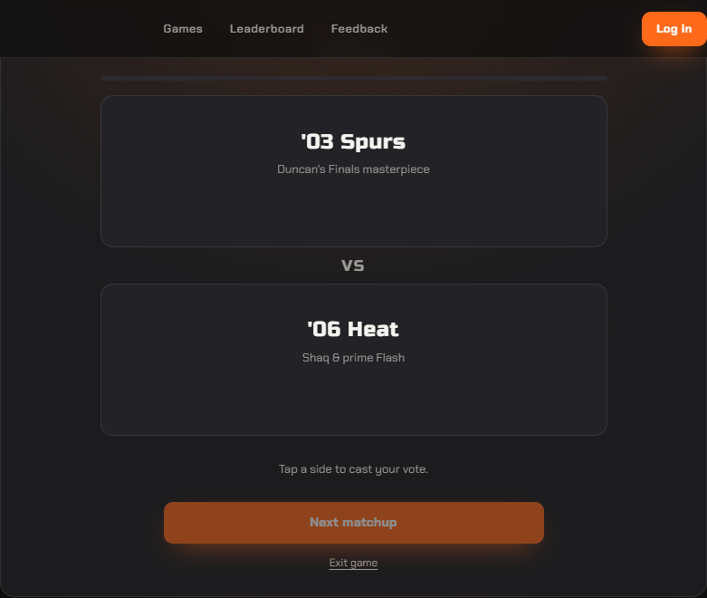
### pack-five
- root: `pf-wrap` — width 520px, gap `12.6px`, align `stretch`
- shell: top 28.6 · game→exit 12 · exit→bottom 28.6
- first child offset: 0 · gaps between children: [12.6,12.6,12.6,12.6]
- absolutely-positioned descendants: pf-card, pf-photo-scrim, pf-name-plate
- 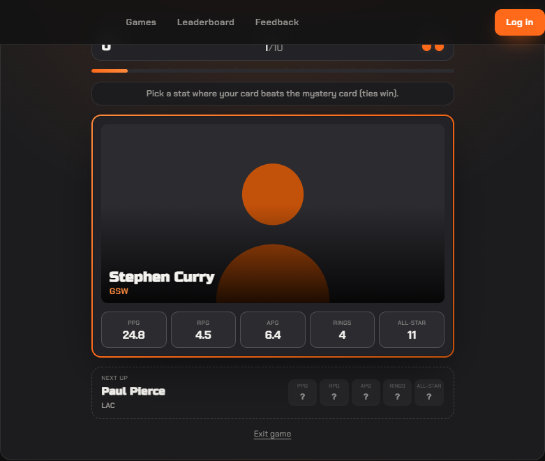
### superdraft
- root: `sd-wrap` — width 480px, gap `12px`, align `normal`
- shell: top 28.6 · game→exit 12 · exit→bottom 28.6
- first child offset: 0 · gaps between children: [12,12,12]
- 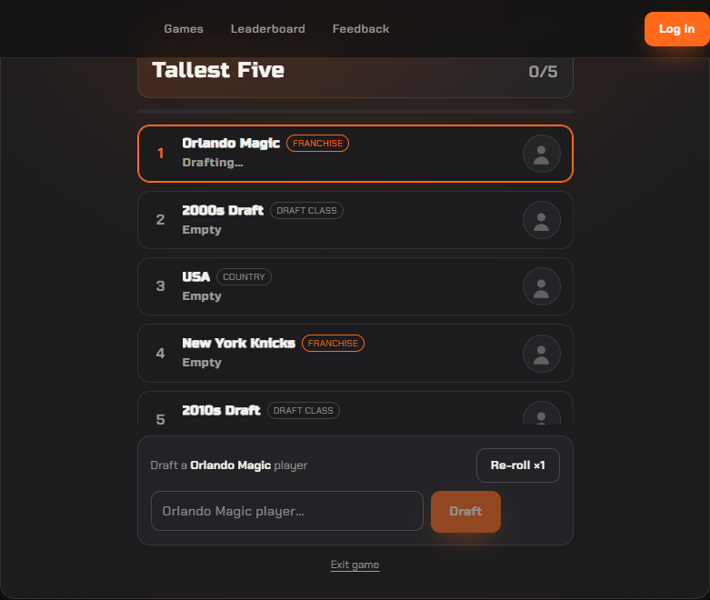
### imposter
- root: `imp-wrap imp-wrap--explain` — width 430px, gap `12px`, align `normal`
- shell: top 28.6 · game→exit 12 · exit→bottom 28.6
- first child offset: 88.6 · gaps between children: []
- 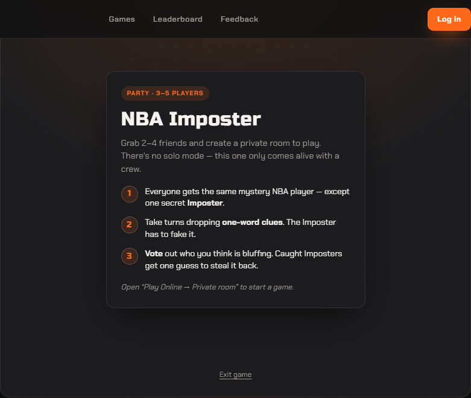