# UI audit — desktop

Viewport 1100×900 · 2026-08-15T21:18:48.399Z

Reference = `series-winner`. Rule 4.2 requires the three shell distances to be identical
in every game. `root gap` / `max-width` / `align` are the game's OWN root — these differing
is why games look unlike each other even when the shell distances pass.

| game | top | →exit | bottom→ | fits vp | in shell | root gap | max-w | align | children |
|---|---|---|---|---|---|---|---|---|---|
| series-winner | PASS | PASS | PASS | yes | yes | 20px | 560px | normal | 3 |
| name-logo | PASS | PASS | PASS | yes | yes | 20px | 560px | normal | 4 |
| guess-mvps | PASS | PASS | PASS | yes | yes | 20px | 560px | normal | 4 |
| starting-five | PASS | PASS | PASS | yes | yes | 20px | 720px | normal | 2 |
| wordle | PASS | PASS | PASS | yes | yes | 20px | 560px | normal | 2 |
| fan-favorites | PASS | PASS | PASS | yes | yes | 20px | 560px | normal | 4 |
| heatmap | PASS | PASS | PASS | yes | yes | 20px | 560px | normal | 3 |
| connections | PASS | PASS | PASS | yes | yes | 20px | 560px | normal | 3 |
| career-path | PASS | PASS | PASS | yes | yes | 20px | 560px | normal | 5 |
| nba-grid | PASS | PASS | PASS | yes | yes | 20px | 560px | normal | 4 |
| who-are-ya | PASS | PASS | PASS | yes | yes | 20px | 560px | normal | 3 |
| tictactoe | PASS | PASS | PASS | yes | yes | 20px | 560px | normal | 3 |
| bingo | PASS | PASS | PASS | yes | yes | 20px | 560px | normal | 4 |
| contexto | PASS | PASS | PASS | yes | yes | 20px | 560px | normal | 3 |
| pack-five | PASS | PASS | PASS | yes | yes | 20px | 560px | normal | 3 |
| superdraft | PASS | FAIL (12 vs 28) | PASS | yes | yes | 20px | 560px | normal | 5 |
| imposter | PASS | PASS | PASS | yes | yes | 20px | 560px | normal | 2 |

## Per-game detail

### series-winner
- root: `gf` — width 560px, gap `20px`, align `normal`
- shell: top 28.6 · game→exit 28 · exit→bottom 28.6
- first child offset: 0 · gaps between children: [20,20]
- 
### name-logo
- root: `gf` — width 560px, gap `20px`, align `normal`
- shell: top 28.6 · game→exit 28 · exit→bottom 28.6
- first child offset: 0 · gaps between children: [20,20,20]
- 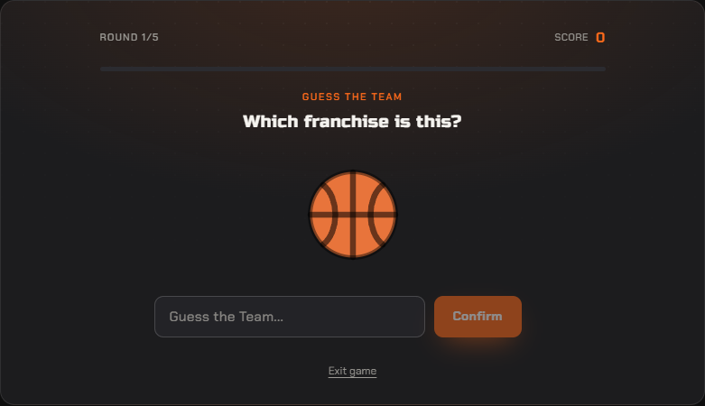
### guess-mvps
- root: `gf` — width 560px, gap `20px`, align `normal`
- shell: top 28.6 · game→exit 28 · exit→bottom 28.6
- first child offset: 0 · gaps between children: [20,20,20]
- 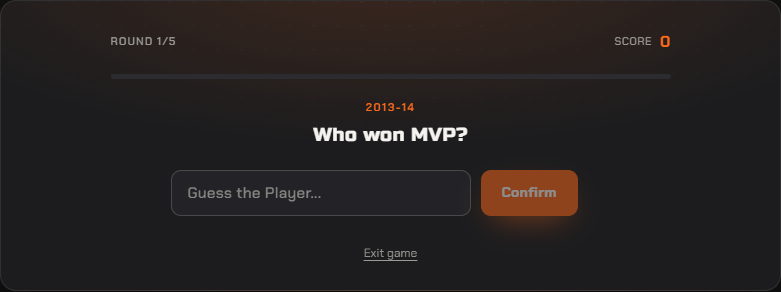
### starting-five
- root: `gf` — width 720px, gap `20px`, align `normal`
- shell: top 28.6 · game→exit 28 · exit→bottom 28.6
- first child offset: 0 · gaps between children: [20]
- absolutely-positioned descendants: s5-flip, s5-face s5-face--front, s5-unknown, s5-unknown-q font-display, s5-face s5-face--back, s5-flip
- 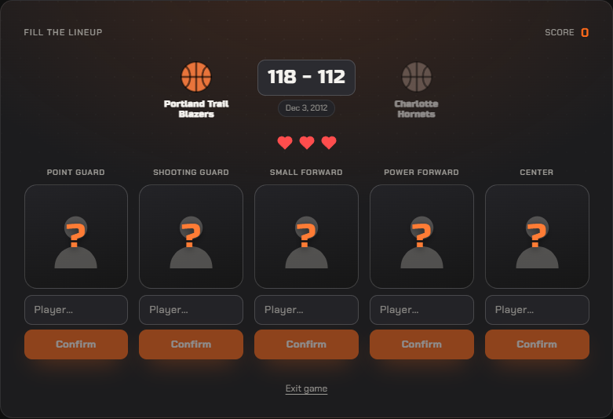
### wordle
- root: `gf` — width 560px, gap `20px`, align `normal`
- shell: top 28.6 · game→exit 28 · exit→bottom 28.6
- first child offset: 0 · gaps between children: [20]
- 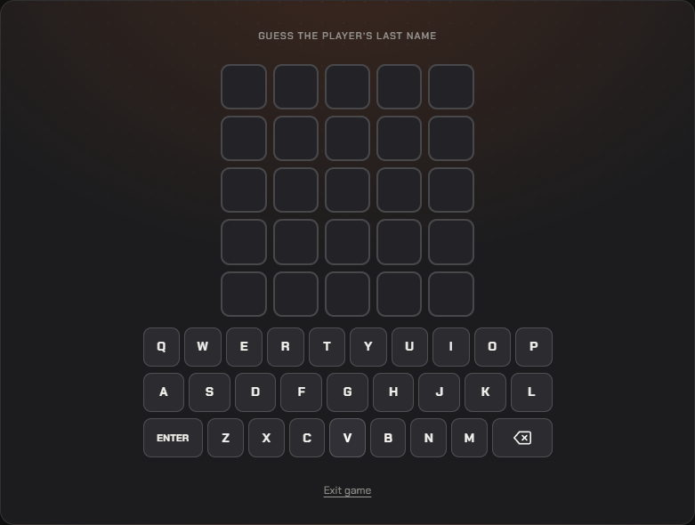
### fan-favorites
- root: `gf` — width 560px, gap `20px`, align `normal`
- shell: top 28.6 · game→exit 28 · exit→bottom 28.6
- first child offset: 0 · gaps between children: [20,20,20]
- 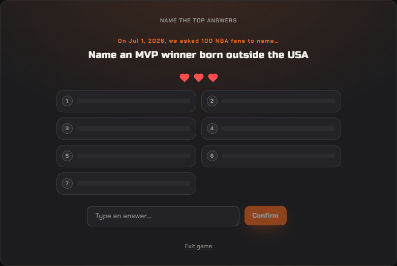
### heatmap
- root: `gf` — width 560px, gap `20px`, align `normal`
- shell: top 28.6 · game→exit 28 · exit→bottom 28.6
- first child offset: 0 · gaps between children: [20,20]
- 
### connections
- root: `gf` — width 560px, gap `20px`, align `normal`
- shell: top 28.6 · game→exit 28 · exit→bottom 28.6
- first child offset: 0 · gaps between children: [20,20]
- 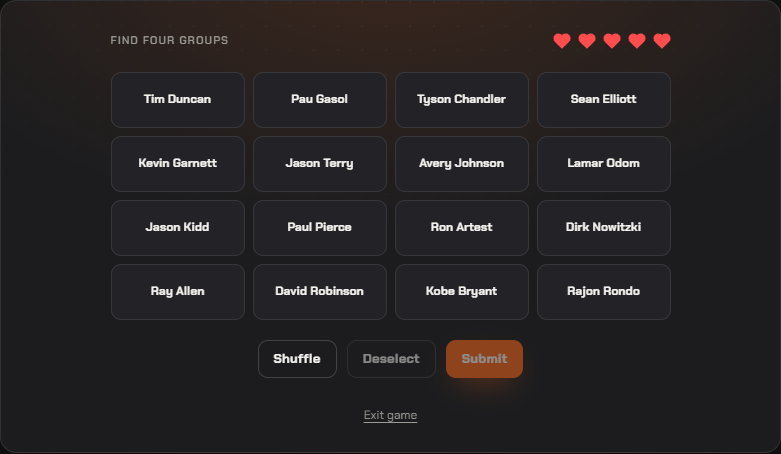
### career-path
- root: `gf` — width 560px, gap `20px`, align `normal`
- shell: top 28.6 · game→exit 28 · exit→bottom 28.6
- first child offset: 0 · gaps between children: [20,20,20,20]
- absolutely-positioned descendants: cp-face cp-face--back, cp-court, cp-face cp-face--front, cp-face cp-face--back, cp-court, cp-face cp-face--front
- 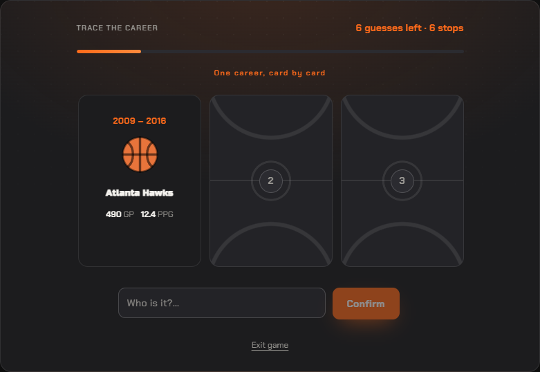
### nba-grid
- root: `gf` — width 560px, gap `20px`, align `normal`
- shell: top 28.6 · game→exit 28 · exit→bottom 28.6
- first child offset: 0 · gaps between children: [20,20,20]
- 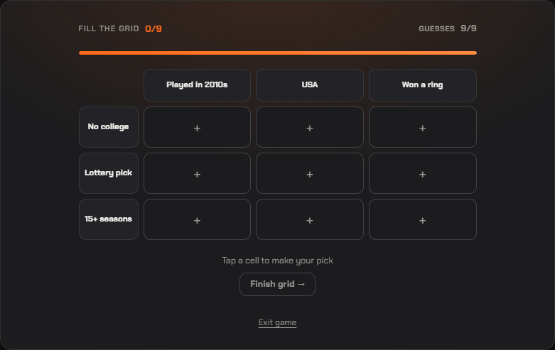
### who-are-ya
- root: `gf` — width 560px, gap `20px`, align `normal`
- shell: top 28.6 · game→exit 28 · exit→bottom 28.6
- first child offset: 0 · gaps between children: [20,20]
- 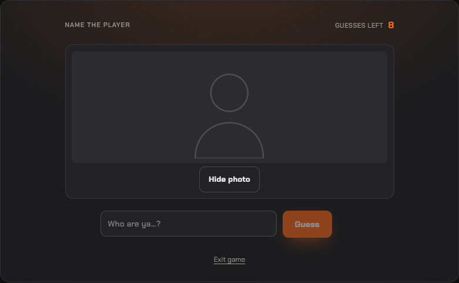
### tictactoe
- root: `gf` — width 560px, gap `20px`, align `normal`
- shell: top 28.6 · game→exit 28 · exit→bottom 28.6
- first child offset: 0 · gaps between children: [20,20]
- 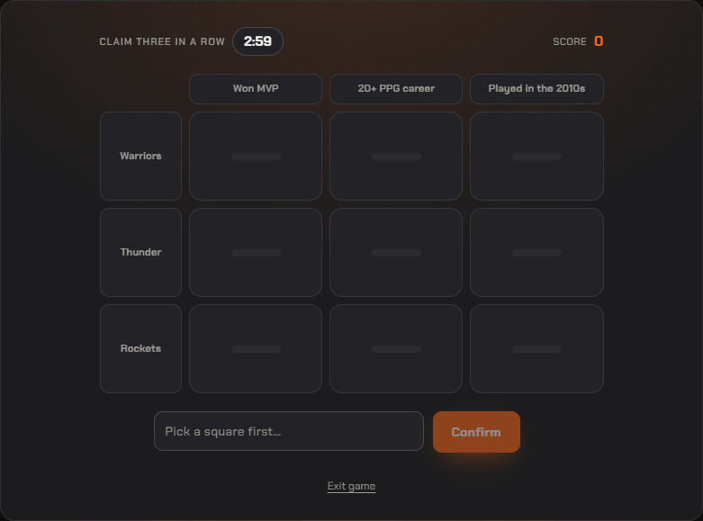
### bingo
- root: `gf` — width 560px, gap `20px`, align `normal`
- shell: top 28.6 · game→exit 28 · exit→bottom 28.6
- first child offset: 0 · gaps between children: [20,20,20]
- 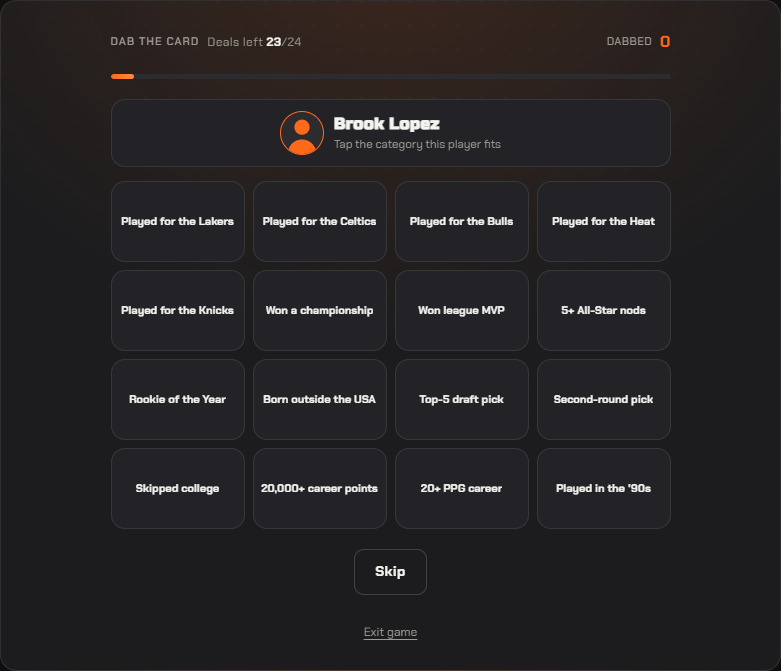
### contexto
- root: `gf` — width 560px, gap `20px`, align `normal`
- shell: top 28.6 · game→exit 28 · exit→bottom 28.6
- first child offset: 0 · gaps between children: [20,20]
- 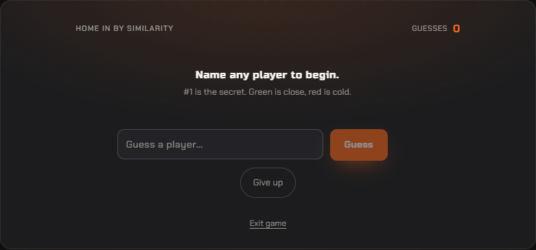
### pack-five
- root: `gf` — width 560px, gap `20px`, align `normal`
- shell: top 28.6 · game→exit 28 · exit→bottom 28.6
- first child offset: 0 · gaps between children: [20,20]
- absolutely-positioned descendants: pf-card, pf-photo-scrim, pf-name-plate
- 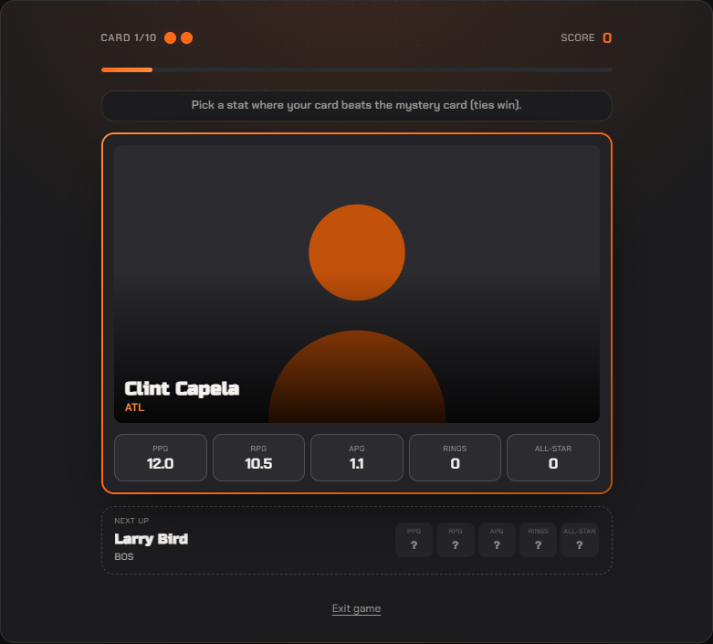
### superdraft
- root: `gf gf--fill` — width 560px, gap `20px`, align `normal`
- shell: top 28.6 · game→exit 12 · exit→bottom 28.6
- first child offset: 0 · gaps between children: [20,20,20,20]
- 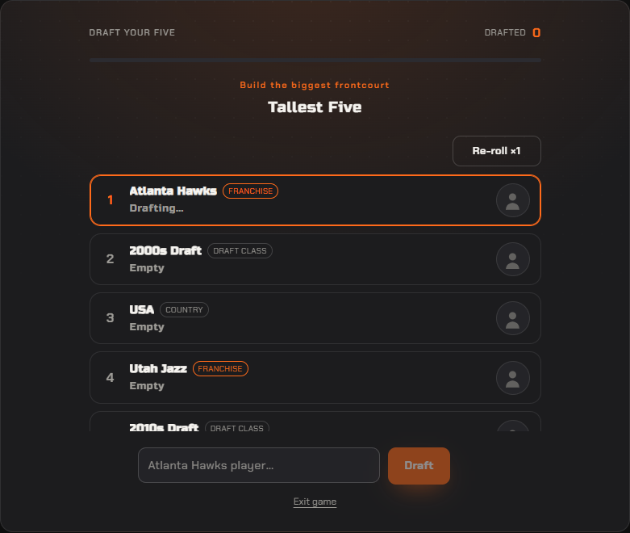
### imposter
- root: `gf` — width 560px, gap `20px`, align `normal`
- shell: top 28.6 · game→exit 28 · exit→bottom 28.6
- first child offset: 0 · gaps between children: [20]
- 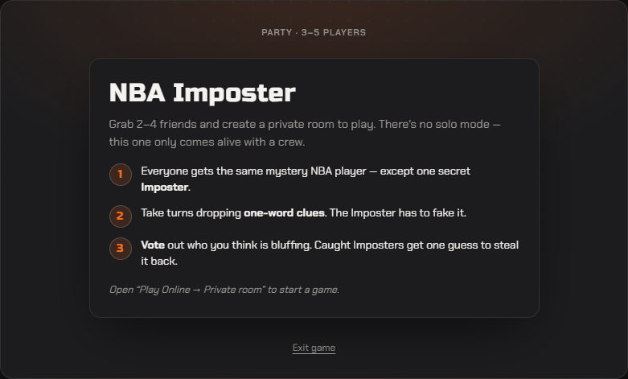