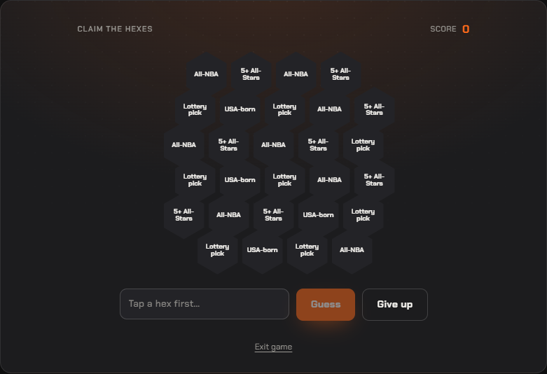

# UI audit — pilot

Viewport 1100×900 · 2026-08-15T12:27:49.307Z

Reference = `series-winner`. Rule 4.2 requires the three shell distances to be identical
in every game. `root gap` / `max-width` / `align` are the game's OWN root — these differing
is why games look unlike each other even when the shell distances pass.

| game | top | →exit | bottom→ | fits vp | in shell | root gap | max-w | align | children |
|---|---|---|---|---|---|---|---|---|---|
| heatmap | — | — | — | yes | yes | 20px | 560px | normal | 3 |

## Per-game detail

### heatmap
- root: `gf` — width 560px, gap `20px`, align `normal`
- shell: top 28.6 · game→exit 28 · exit→bottom 28.6
- first child offset: 0 · gaps between children: [20,20]
- 