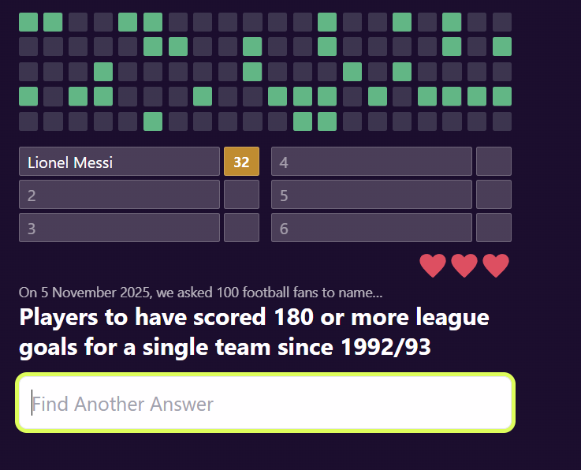
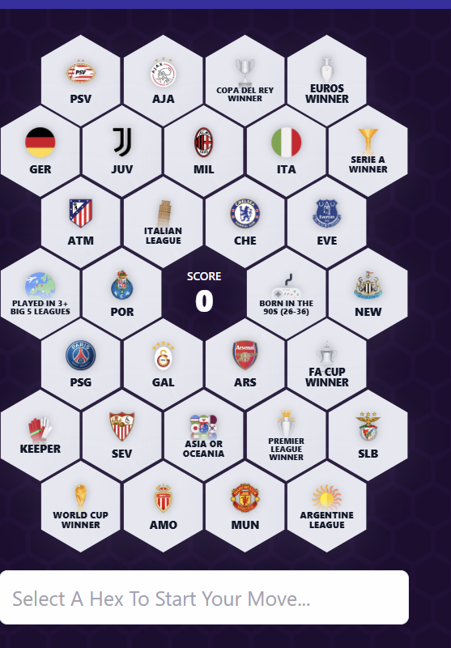
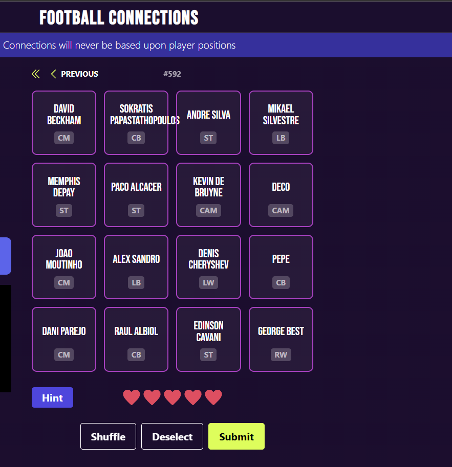
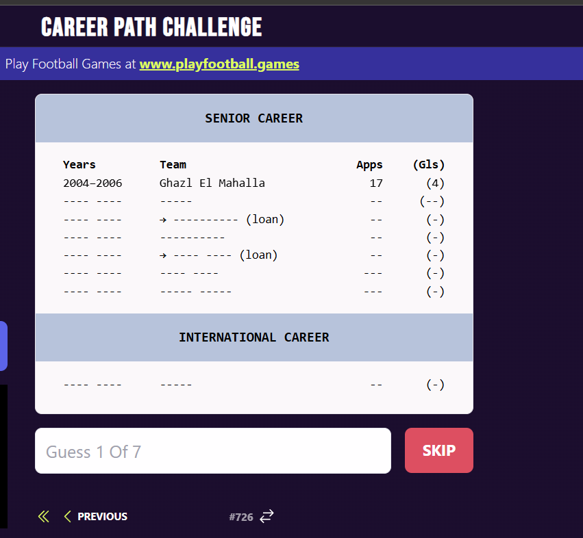
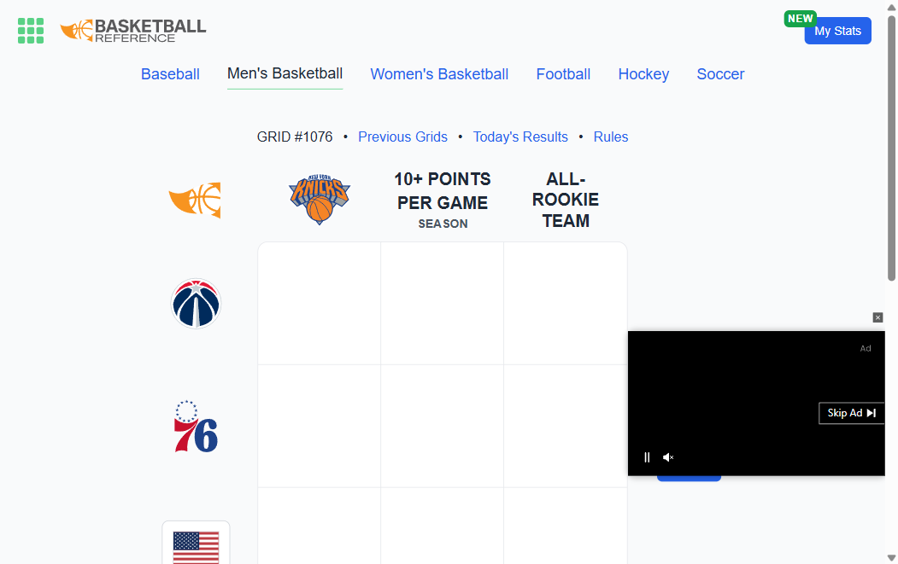
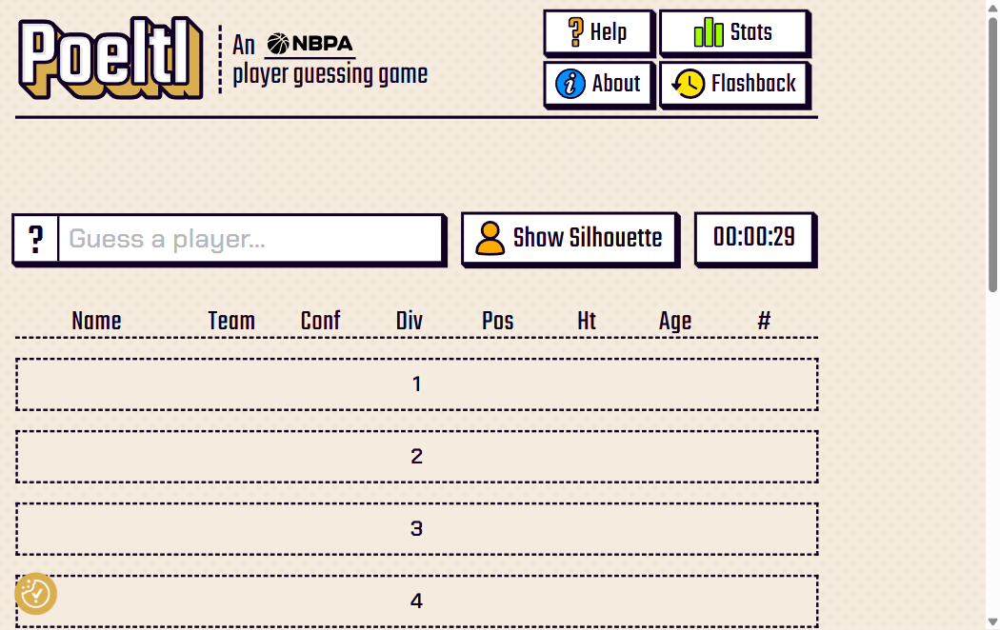
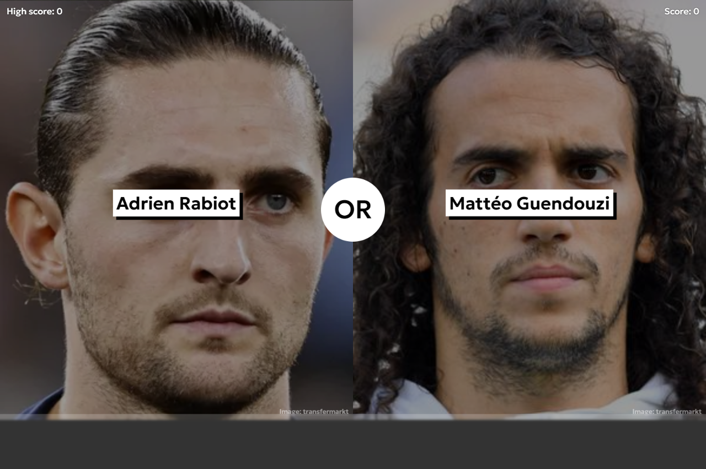
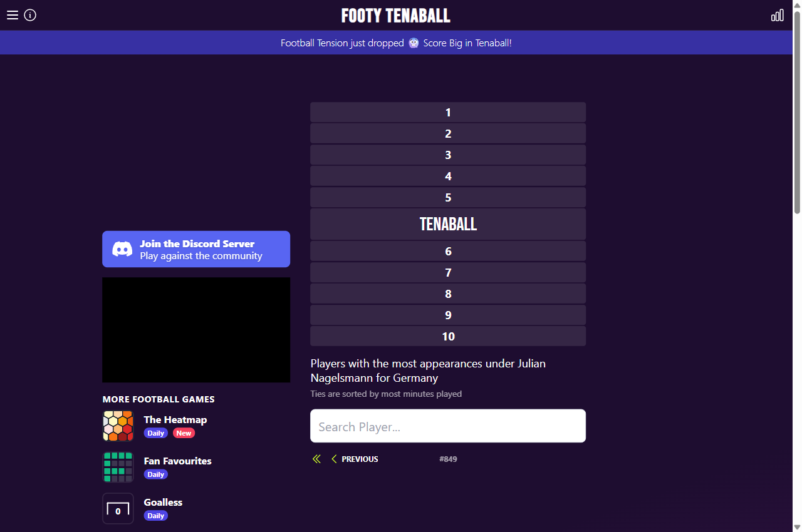
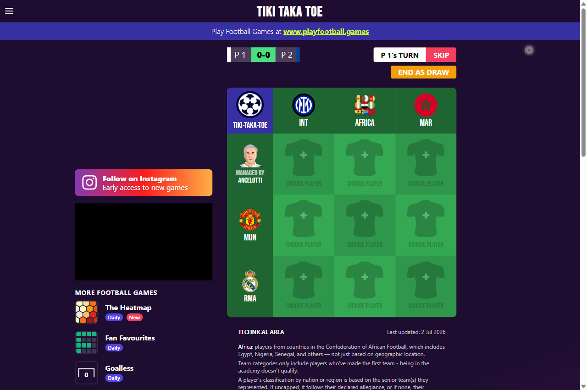
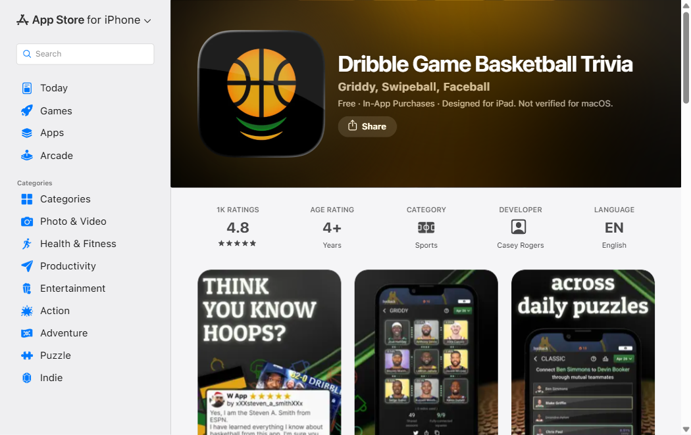

# NBA Minigames — Master Plan

Single source of truth for every game the app has, is building, or should build.
Compiled 2026-07-04 from: the "New Games – Hoops24 Games" spec (4 committed games), a full scan of
playfootball.games (23 games), premierleague.com/en/games (9), hoopgoat.com (16), the NBA trivia
market (Poeltl, Immaculate Grid, HoopGrids, Crossover Grid, Dribble Game, Sporcle, NBA Play…), and
generic daily-puzzle mechanics (Wordle, Connections, higher/lower, Contexto…).

Reference screenshots live in [docs/game-research/](docs/game-research/). **Images are mechanic/layout
references only — never copy their visual style.** Every game must be re-skinned to the app's own
design system (see §2).

---

## 1. Status tracker

Update this table whenever a game ships or its status changes.

| # | Game | Status | Priority | Route | Max pts | Modes |
|---|------|--------|----------|-------|---------|-------|
| E1 | Guess the Series Winner | ✅ Live | — | /series-winner | 50 | S/M/F |
| E2 | Name the NBA Club (logos) | ✅ Live | — | /name-logo | 50 | S/M/F |
| E3 | Guess the MVP | ✅ Live | — | /guess-mvps | 50 | S/M/F |
| E4 | Fill in the Starting 5 | ✅ Live | — | /starting-five | 100 | S/M/F |
| E5 | NBA Wordle | ✅ Live | — | /wordle | 500 (legacy outlier) | S/M/F |
| W1-1 | Fan Favorites | ✅ Live (migration 0003 + 24 questions applied to Supabase 2026-07-06) | P0 (committed) | /fan-favorites | 300 | S/M/F |
| W1-2 | The Heatmap (hex grid) | ✅ Built 2026-07-06 | P0 (committed) | /heatmap | ~50/hex | S/M/F |
| W1-3 | NBA Connections | ✅ Built 2026-07-06 | P0 (committed) | /connections | 200 | S/M/F |
| W1-4 | Career Path Challenge | ✅ Built 2026-07-06 | P0 (committed) | /career-path | teams×100 | S/M/F |
| W2-1 | NBA Grid (3×3 + rarity) | ✅ Built 2026-07-06 | P1 — #1 market demand | /nba-grid | 270 | S/M/F |
| W2-2 | Who Are Ya: NBA (de-blur guesser) | ✅ Built 2026-07-06 | P1 — #2 market demand | /who-are-ya | 240 | S/M/F |
| W2-3 | Higher / Lower | 📋 Wave 2 | P1 | /higher-lower | 10/streak step | S/M/F |
| W2-4 | Top-10 Board | 📋 Wave 2 | P1 | /top-ten | 300 | S/M/F |
| W2-5 | NBA Tic-Tac-Toe (duel) | ✅ Built 2026-07-06 | P1 — PvP gap in market | /tictactoe | +50 win | M/F only |
| W2-6 | Teammate Chain | 📋 Wave 2 | P2 | /teammate-chain | 250 | S/M/F |
| W3-1 | NBA Bingo | ✅ Built 2026-07-06 | P2 | /bingo | 200 | S/M/F |
| W3-2 | Brickless (inverse Fan Favorites) | 📋 Wave 3 | P2 | /brickless | 300 | S/M/F |
| W3-3 | LeContexto (similarity guesser) | ✅ Built 2026-07-06 | P2 | /contexto | 200 | S/M/F |
| W3-4 | Emoji Riddles | 📋 Wave 3 | P3 | /emoji | 150 | S/M/F |
| W3-5 | Pixel Reveal (players + retro logos) | 📋 Wave 3 | P2 | /pixel-reveal | 150 | S/M/F |
| W3-6 | NBA Timeline | 📋 Wave 3 | P3 | /timeline | 200 | S/M/F |
| W3-7 | Blind Rank suite (+ Start·Bench·Cut) | 📋 Wave 3 | P2 | /blind-rank | 100 (graded) | S/M/F |
| W3-8 | Who Would Win (votes) | ✅ Built 2026-07-06 | P3 | /who-would-win | none (opinion) | S |
| W3-9 | Guess the Franchise | 📋 Wave 3 | P3 | /guess-franchise | 150 | S/M/F |
| W3-10 | SuperDraft Five | ✅ Built 2026-07-06 | P3 | /superdraft | metric-based | S/M/F |
| W3-11 | Pack 5 (stat trumps) | ✅ Built 2026-07-06 | P3 | /pack-five | 220 | S/M/F |
| W3-12 | Slate Predictor | 📋 Wave 3 | P2 | /predictor | 10/game | S |
| W3-13 | Standings Predictor | 📋 Wave 3 | P3 (seasonal) | /standings-predictor | 500 | S |
| W3-14 | List Blitz (timed name-every-X) | 📋 Wave 3 | P2 | /list-blitz | 5/answer | S/M/F |
| W3-15 | NBA Imposter (party) | ✅ Built 2026-07-06 | P3 | /imposter | party scoring | F only (3+) |
| W3-16 | ArenaGuessr | 📋 Wave 3 | P3 | /arena-guessr | 5000/round scaled | S/M/F |
| W3-17 | Possession Play (hex territory PvP) | 📋 Wave 3 | P2 (reuses W1-2 engine) | /possession | territory | M/F only |
| W3-18 | Quiz Library (MCQ, SEO layer) | 📋 Wave 3 | P3 | /quizzes | 10/question | S |

Modes: **S** = single-player, **M** = online multiplayer (matchmaking), **F** = friend room (code).

**Why this priority order (market evidence):**
1. **3×3 criteria grid** — Immaculate Grid: ~1M weekly players, ~200k/weekday, acquired by Sports
   Reference, TV show in development. Four competing NBA implementations and all thriving.
2. **Attribute-feedback player guesser** — Poeltl: 50k+ daily players, officially acquired/relaunched
   by the NBPA (Feb 2024). The "poeltl unlimited" clone economy proves unmet demand for unlimited mode.
3. **Connections** — NYT's #2 game (3.3B plays in 2024); 6+ independent NBA clones already compete.
   Cheapest daily content to produce.
4. **PvP trivia** — the biggest open gap: every incumbent NBA web game is single-player. Tiki Taka Toe
   proved the duel format goes viral through creator videos. Your app already has a socket server —
   a structural advantage no competitor has.
5. **Survey games (Fan Favorites/Brickless)** and **opinion games (Blind Rank/Who Would Win)** —
   near-zero content cost, community-generated answer keys, high share/debate value.

### Build log

**2026-07-04** — Shared infra sprint + Fan Favorites (W1-1). Time tiebreak (`rankRoom`), session
timer, `GameSession`/`GuessLog` models + logging endpoints, alias matcher.

**2026-07-06** — 12 games built in one push (multi-agent): Heatmap, Connections, Career Path, NBA
Grid, Who Are Ya, Tic-Tac-Toe, Bingo, LeContexto, Who Would Win, SuperDraft, Pack 5, Imposter.
- **Data foundation**: `backend/trivia/data_static/players_curated.json` — **159 real players**
  (48/50/36/25 across fame tiers, 92 with 4+ team stints, every `person_id` resolved via nba_api),
  published as the `players-index` pool that the criteria/guesser games read.
- **Turn engine**: `multiplayer_server/src/turnGames.js` — server-authoritative Tic-Tac-Toe + Imposter
  (per-uid redaction so the imposter's client never receives the mystery player).
- **Supabase**: migration `0003` (fanfavoritesquestion/gamesession/guesslog) applied + 24 Fan
  Favorites questions seeded (verified live).
- **Verified**: `tsc -b` clean, eslint clean, production build ships all 21 pools, `node --check`
  both server files, `manage.py check` clean, **121 backend tests pass**, all 12 game modules serve
  their round data, dev server boots with every route + pool 200-OK. Targeted correctness sweep
  confirmed no shared-pool-cache mutation and timer-cleanup safety in the new renderers.
- **Remaining hardening (not blocking)**: full 12-game live-play browser smoke and the 3 adversarial
  reviews (spec fact-check of seeds / correctness / UI) were deferred — the workflow stalled on them
  after the games were done; recommend running `/code-review` on the diff before deploy.
- **Deploy**: single-player is static-pool driven and ready. Multiplayer + turn games need the
  Socket.IO server (`multiplayer_server`) and Django redeployed. Imposter needs a friend room of 3–5.

Not yet built (next up per §8): Higher/Lower (W2-3), Top-10 (W2-4), Teammate Chain (W2-6),
and the rest of Wave 3.

---

## 2. Global rules — apply to EVERY game

### Modes & multiplayer
- Every game ships with **single-player**, **online multiplayer** (points-fair matchmaking, exists),
  and **play with a friend** (6-digit room code, exists) unless marked otherwise (e.g. Imposter needs 3+).
- **Tiebreak = time.** If final scores are equal, the player with the lower total answer time wins.
  ⚠️ Infra change required: `submitScore` currently sends only `{code, score}` and `settleMatch`
  reports plain ties. Extend the payload to `{code, score, elapsedMs, finishedAt}` and rank by
  score DESC, then elapsedMs ASC. Do this once, before Wave 1 multiplayer ships.
- Multiplayer variants remove assistance features (e.g. Connections loses its Shuffle button,
  hint buttons disabled) — same info for both players, skill only.

### Timestamps & timers
- **A session timer is always visible** during play (top of the Stage, `.tnum` class, mm:ss) so
  players always know how long they've played. Store `started_at` / `finished_at` per session.
- Per-question elapsed time is recorded silently for the tiebreak and future stats.
- Recommended target session lengths (used in the specs below): quick dailies 1–3 min, board
  games 3–5 min, party games 5–10 min. A game should never *require* more than ~6 minutes.

### Scoring tone
Keep new games inside the established economy (existing games award 50–100 per session; user rank
thresholds start at 100). Guideline: **~50 points per meaningful correct answer, 100–300 per perfect
session.** NBA Wordle's 500 jackpot is a legacy outlier — don't emulate it. Time never adds points;
it only breaks ties. Exceptions where a spec'd formula exceeds the ceiling (Heatmap's 50/hex,
ArenaGuessr's 5000/round) keep their in-game numbers but cap/normalize the profile-points
contribution at ≈300 per session.

### UI adaptation (never copy the reference sites)
- Dark shell: `--bg #101010`, surfaces `#1c1c1e / #232327 / #2b2b30`, radius 14px.
- **Orange is the one accent**: `--brand #ff6a1a` (+ `#ff8a3d`, deep `#c2510a`, soft
  `rgba(255,106,26,.14)`). Correct = `--good #2fc762`, mistakes/hearts = `--bad #ff4d4d`.
  Reference sites use purple/lime/cyan accents — always swap to the orange slot.
- Type: Russo One for display, Chakra Petch for body, `.tnum` for all numbers/timers.
- Reuse shared components: `Stage`, `Button`, `Chip`, `ProgressBar`, `CourtLoader`,
  `AutoCompleteInput`, `Modal`, `GameResult`, `CorrectAnswer`, `motion/*`. Game boards themselves may
  use light/neutral cells for legibility (the pattern every reference site uses inside dark shells).
- Celebration: the app has `react-confetti` — use it for perfect boards/completions.

### Mobile & responsiveness
- Build from modular components; **the full play area must fit one mobile viewport — no scrolling
  mid-game.** Test at 390×844 before calling a game done. Hex grids/boards scale via
  `clamp()`/viewport units; keyboards/inputs anchor bottom.

### Data hygiene & fallbacks (blocking rules)
- Only clean rows feed questions: the pool builder **excludes** any entity missing a required field
  for that game (e.g. a player without a headshot never becomes a Pixel Reveal answer).
- Every image has a fallback: player photo → grey silhouette asset; team logo → `TeamCrest`
  fallback initials; college logo missing → that university question is never asked (per
  players_extensive_data.md).
- Name matching is alias-aware everywhere (last-name-only, accents, nicknames: "AI" → Iverson).
  Build the alias matcher once as a shared util.

### Question banks & the Supabase transition rule
- All question/puzzle banks live in Supabase Postgres behind the Django ORM (see §5).
- **Survey-type games** (Fan Favorites, Brickless, Who Would Win): seed answer boards editorially at
  launch; log every real player's guesses; when a question has enough samples (threshold ~500
  guesses), **automatically switch** its board to the live player-derived standings. No manual
  intervention. The same guess log powers the NBA Grid rarity score.

### Adding a game (4 touchpoints, from the codebase)
1. Route in `App.tsx` → 2. entry in `games[]` in `src/utils/GameUtils.tsx` (id, tag, rules,
maxPoints, fetchData, background) → 3. case in `src/Game Renderers/RenderGame.tsx` →
4. multiplayer: `multiplayer_server/src/gameEndpoints.js` + Django endpoint/pool.

### Verify after each game (improve process each time)
1. `npm run lint` + `npx tsc -b && npm run build` pass. 2. Play a full round S + F modes.
3. Mobile viewport check (no scroll). 4. Kill the network mid-game → graceful error. 5. Feed it a
dirty-data row → confirm exclusion. 6. Note what went wrong in this build and fix the checklist/
process before starting the next game.

---

## 3. Wave 1 — the four committed games (from the Hoops24 spec)

### W1-1 · Fan Favorites — "We asked 100 NBA fans…"

*Also: [full desktop layout](docs/game-research/fan-favourites-ref-full.png) ·
[live site capture](docs/game-research/fan-favourites.png)*

Family-Feud-style: a question with ≥6 hidden popular answers; type answers to reveal them on the board.

**Rules (per spec):**
- Question bank in Supabase; every question has **at least 6 answers**. Questions are built from
  players data, teams data, or general NBA facts ("Name a team with 3+ championships",
  "Name a clutch playoff performer", "Name a player who won MVP after 2010").
- Board shows numbered slots (1 = most popular). Player types free-text answers, alias-matched.
- **3 hearts.** A miss (valid word but not on board, or invalid) costs 1 heart.
- **Scoring: `score = round(300 × revealed / total_answers)`.** This reproduces both spec examples
  exactly (all answers found ⇒ 300; dead at 0 hearts with 5 of 6 found ⇒ 250) and scales to boards
  with more than 6 answers. *Design decision recorded: the spec's "each mistake cost 50 points" and
  its own worked examples conflict under a literal −50 reading (full clear + 2 mistakes would be
  200, but the spec says all-answers-before-hearts-expire = 300). The formula above is the only
  rule consistent with both spec sentences — on a 6-answer board every heart lost forfeits exactly
  the 50 points of the answer you'll miss. ⚠️ Confirm with the owner before shipping if −50
  deductions were truly intended.*
- Multiplayer: same question both sides; equal points → faster total time wins (spec explicitly
  includes the timer tiebreak here).
- Answer standings: seeded editorially → auto-transition to real player-guess distributions once
  ≥500 logged guesses (see §2, Supabase transition rule).

**UI:** slot boxes fill **orange** (`--brand`) on correct reveal with a pop animation
(`motion/Reveal`); full-board clear triggers confetti + a "GOLDEN BOARD" flash. Hearts use
`--bad` red. Board + question + input all fit one phone screen: 2×3 slot grid on mobile.
**Time to play:** ~2–3 min. **Data:** question bank w/ ranked answers + aliases; guess log.

---

### W1-2 · The Heatmap — hex-grid category board

*Also: [selection state](docs/game-research/heatmap-ref-selection.png) ·
[solved-orange state](docs/game-research/heatmap-ref-solved-orange.png) ·
[live site capture](docs/game-research/the-heatmap.png)*

Hex board (~30 hexes, center hex = score display) where each hex is an NBA criterion: a franchise
logo, an award ("Won MVP"), a stat feat ("10k+ career points"), a draft fact ("Drafted in a top-5
pick", "Drafted 2011"), a country, a college.

**Rules (per spec):**
- Question sets are predefined and adjustable (stored in Supabase; the board layout — which
  criterion sits on which hex — is a versioned config).
- Click a hex → name a **player** (never a team) who satisfies the clicked hex's criterion **AND
  the criterion of every neighbouring hex**. Correct ⇒ hex claimed.
- **+50 points per correctly claimed hex** (spec). No hearts. Multiplayer: same board, tie → time.
  ⚠️ Points-economy note: ~30 claimable hexes ⇒ a perfect board is ~1,500 raw points, ~5× the app's
  100–300 session ceiling (§2). Show raw points in the game HUD, but **cap the profile-points
  contribution at 300 per session** (normalized) so ranks don't inflate — same pattern as capping,
  not changing, the spec's 50/hex rule. Owner call if the full raw total should count instead.
- ⚠️ **Solvability validation is mandatory:** the board generator must verify every hex has ≥1
  valid player for (hex + all its neighbours) against the player-category index; regenerate until
  valid. Corner hexes have 2–3 neighbours, center hexes up to 6 — difficulty rises toward the middle,
  which is good design. (The original site instead uses claim+adjacency combo scoring — keep that
  in mind as a future "Combo mode" config, but ship the spec's rule first.)

**UI:** claimed hexes fill **orange** with the criterion still visible (spec requirement) — use
`--brand` fill, dark text, slight scale pulse on claim. Unclaimed hexes are light neutral cells
(reference pattern) with team logos/criterion text. Mobile: hexes sized via `clamp()`, board fits
viewport, input drawer anchors bottom.
**Time to play:** ~4–5 min. **Data:** player-category truth index (stints, awards, stats, draft,
college, country) + board configs. **Engine note:** build the hex board + validator as a reusable
module — Possession Play (W3-17) is the same engine in PvP territory mode.

---

### W1-3 · NBA Connections — find the four groups

*Also: [live football version](docs/game-research/football-connections.png) ·
[NYT original](docs/game-research/nyt-connections-group-of-four-sorting.png)*

16 NBA players hide 4 groups of 4 sharing a link ("Won a ring with the Spurs", "Drafted 2011",
"Kentucky alumni", "Played with LeBron"). Never position-based (spec keeps the football rule).

**Rules (per spec):**
- Select exactly 4 tiles → Submit activates (spec: submit inactive under 4 selections).
- **+50 points per correct group** (max 200). 5 hearts as shown in the reference; a wrong submission
  costs one. "One away!" toast when 3 of 4 are right.
- Single-player keeps Shuffle + Deselect; **multiplayer removes Shuffle** (spec) and hints.
- Bank scale (spec): generate enough puzzles "for millions of players" — target ≥2,000 validated
  boards; each board machine-checked so **no tile fits two groups** (trap overlaps allowed only when
  exactly one full solution exists) and no player is left orphaned. Sessions draw randomly from the
  bank so repeat probability ≈ 0; daily mode serves one shared board.
- **Bank generation plan** (hand-authoring can't reach 2,000): a generator script walks the
  player-category truth index (§7 derived artifacts), samples 4 compatible trait tags (team-mate
  sets, draft classes, colleges, award cohorts, jersey numbers…), picks 4 members each, then runs
  the exactly-one-solution validator; survivors land in `trivia_question` as status=draft for a
  quick human spot-check queue in Django admin. Launch with ~300 published boards (mix of ~50
  hand-curated "clever trap" boards for the daily slot + generated fill for unlimited mode), grow
  to 2,000 with the generator.
- Tie in multiplayer → total time.

**UI:** solved groups collapse into full-width **orange-gradient bars** (difficulty tiers:
`#ffb347` easy → `#ff8a3d` → `--brand` → `#c2510a` hardest) with the category label revealed.
4×4 grid fits mobile width; player names auto-shrink (long names: two lines, 12px floor).
**Time to play:** ~2–4 min. **Data:** trait tags (teams, teammates, draft class, college, country,
awards, jersey numbers, nicknames) + curated/generated puzzle bank + validator tool.

---

### W1-4 · Career Path Challenge

*Also: [live site capture](docs/game-research/career-path-challenge.png)*

Guess the mystery player from his team-by-team career path.

**Rules (per spec):**
- Mystery player's career shown as **cards, one per team stint** (spec: basketball-oriented card UI,
  not the Wikipedia-table look): years (active players: "2019 – present"), team, GP, PPG. Only the
  first card starts revealed; **team logo appears on a card when it's revealed**.
- Guesses allowed = number of teams (x). Each wrong guess flips the next team card.
- **Score = (x − y) × 100** where y = wrong guesses (spec example: 7 teams, 3 misses ⇒ 400). Run out
  of guesses ⇒ 0 points and the player's name + headshot shown in a reveal container at the bottom.
- Draft info (year/round/pick + drafted-by team) is the final card. Tie in multiplayer → time.

**UI:** team cards use `--surface2` with the team's logo and an orange year chip; unrevealed cards
show a court-pattern back. On mobile the card rail pans horizontally *inside* its own container —
explicitly allowed; the no-scroll rule (§2) forbids **page** scrolling, not in-component panning;
the whole game still fits one viewport. `AutoCompleteInput` for guesses.
**Time to play:** ~2–3 min. **Data:** complete per-player team chronology with years + GP/PPG per
stint, draft data, headshots. Pool rule: only players with ≥2 team stints and complete stint data.

---

## 4. Wave 2 — market-validated headliners

### W2-1 · NBA Grid — 3×3 criteria grid with rarity score

*Also: [HoopGrids](docs/game-research/hoopgrids-nba-connections-i-called-game-.png) ·
[Crossover Grid](docs/game-research/crossover-grid.png)*

Rows/columns carry criteria (franchise × franchise, franchise × award, × stat threshold, × draft
fact); fill all 9 cells with players matching both. **9 guesses total; wrong guesses burn one.**
Scoring: **30 pts/cell (270 perfect)** + a **rarity score** — after finishing, each answer shows what
% of players picked it (from our guess log; lower total = bragging rights, shown on the share card
but not added to points). Differentiators vs incumbents: post-game breakdown of top picks per cell,
easy/normal/expert daily grids from one dataset, and a **timed Box2Box variant** (3-minute clock,
extra valid answers = bonus) nobody serves for NBA. Multiplayer: same grid, score → time tiebreak.
**Time:** 3–5 min. **Data:** stint history, awards, season stats, draft; per-cell valid-answer
counts; guess-frequency aggregation. Generator must guarantee ≥3 valid answers per cell.

### W2-2 · Who Are Ya: NBA — photo de-blur + attribute feedback

*Also: [Who Are Ya](docs/game-research/who-are-ya-independent-variants.png) ·
[Poeltl Unlimited clone](docs/game-research/poeltl-unlimited-clone-ecosystem.png) ·
[HoopGoat's 3-mystery variant](docs/game-research/daily-trivia.png)*

Merge the two best guessers: heavily blurred headshot that sharpens each miss (Who Are Ya) +
attribute feedback columns (Poeltl): conference, division, team, position, age, jersey #, draft year
— green exact / **yellow close** (age ±2, jersey ±5, draft ±3, right conf wrong div) with ↑↓ arrows.
**8 guesses. Score: 240 − 30 per wrong guess** (solve on first ⇒ 240). Hard mode hides the photo.
Ship **daily + unlimited + legends** modes from day one — the "poeltl unlimited" clone economy is
free demand the official game refuses to serve. **Time:** 1–3 min.
**Data:** headshots (CDN + silhouette fallback), bios, jersey, draft, era tags, fame tier
(difficulty pools).

### W2-3 · Higher / Lower — stat streak

Two player cards; left shows the value (career points, salary, rings, triple-doubles, IG followers),
right shows only the name — call higher or lower. Correct: value animates up (`AnimatedNumber`),
card slides left, streak +1. **Daily mode: fixed 10-card sequence, 10 pts each (100 max), share
card.** Unlimited mode: endless streak, milestone badges at 5/10/20. One wrong = run ends (show the
number — the "receipt" moment). Category picker multiplies content from one table. Multiplayer:
same 10-card seed, tie → time. **Time:** 1–2 min daily. **Data:** career/season totals, salaries,
follower counts (refresh monthly), headshots.

### W2-4 · Top-10 Board — Tenable for the NBA

Daily board: "Top 10 all-time scorers", "Top 10 picks of the 2003 draft", "Kobe's 10 highest-scoring
games — vs which teams". Type answers; hits flip open at their rank slot. 3 hearts.
**Scoring (Tension mode): rank-position value × multiplier; multiplier starts ×5 and drops per
miss** — hunting #9/#10 early is the skill move. Normalize so a perfect board ≈ 300. Multiplayer:
same board, tie → time. **Time:** 2–4 min. **Data:** ranked stat lists with values (career/season/
game/draft/salary leaderboards), alias matcher, 10-day archive.

### W2-5 · NBA Tic-Tac-Toe — the PvP flagship

Head-to-head 3×3: criteria on rows/columns; on your turn claim a cell by naming a valid player;
**25s turn timer; 3 steals each** (retake an occupied cell with a *different* valid player); three
in a row wins. Same-device pass-and-play AND socket rooms — this is the game that markets itself
(creator-filmable). Win = match result, not points (award flat +50 rank points to the winner).
Solo fallback: daily grid vs the clock. **Time:** 3–5 min. **Data:** same index as W2-1 + turn
engine in the socket server (first truly turn-based game — build the turn/timer room primitive
once, Possession Play and Imposter reuse it).

### W2-6 · Teammate Chain — six degrees of the NBA

Connect Player A to Player B through shared *teammates* (overlapping team-season stints) in ≤6
links. **Score: 250 − 50 per link beyond the shortest possible path** (shortest-path solver
validates). Daily pair for everyone + unlimited. Multiplayer: same pair, fewest links, tie → time.
**Time:** 2–4 min. **Data:** teammate graph precomputed from stints (player-pair + seasons shared)
+ BFS solver endpoint.

---

## 5. Wave 3 — retention, social & seasonal layer (compact specs)

**W3-1 · NBA Bingo** — 16-category card; dealt player cards one at a time, "dab" each onto exactly
one matching category (LeBron fits 6 cells — allocation is the tension). Wrong dab = skip next deal.
Complete the card before the deck runs out; 200 pts scaled by turns used. Friend-room race mode.
⏱ 3–4 min. *Data: player-category truth matrix, headshots.*

**W3-2 · Brickless** — inverse Fan Favorites (Pointless): 5 answers, **rarest valid answers score
best**; find a 0-point answer (nobody else said it) for the Zero Shield. Shares the Fan Favorites
survey dataset with inverted scoring — two games, one data pipeline. 300-pt normalization. ⏱ 2–3 min.

**W3-3 · LeContexto** — [reference](docs/game-research/futbol11-goltexto-football-contexto.png).
Secret player; unlimited guesses; every guess shows a similarity rank (#1 = answer) from a
franchise/era/position/draft/stats/awards vector. No fail state — beginner-friendly. 200 pts −5 per
guess past 10. ⏱ 2–5 min. *Data: similarity index over player vectors.*

**W3-4 · Emoji Riddles** — 🇬🇷🦌 = Giannis; 🐍#8#24 = Kobe; 🐝🌆 = Hornets. 6 guesses, +1 clue emoji
per miss; 150 → −25 per reveal. Daily 3-riddle set; later: user-submitted riddles w/ moderation.
⏱ 1–2 min. *Data: curated riddle bank, nicknames.*

**W3-5 · Pixel Reveal** — pixelated headshot or **historical/defunct logo** (Vancouver Grizzlies!)
sharpens over 6 steps; 150 − 25/step. Natural extension of the live Name-the-Logo game — reuse its
renderer + add the pixelation pipeline (client-side canvas). ⏱ 1–2 min. *Data: headshots,
historical logos.*

**W3-6 · NBA Timeline** — drag event cards ("Malice at the Palace", "KD to the Warriors", "Sonics
become the Thunder", "LeBron passes Kareem") into chronological order; 3 lives; daily 10-card deck;
20 pts/card. ⏱ 2–3 min. *Data: dated events table (also feeds Quiz Library).*

**W3-7 · Blind Rank suite** — [reference](docs/game-research/blind-tier-list-blind-rank.png).
One engine, three skins: Blind Tier List (10 players revealed one at a time → S/A/B/C, locked once
placed, graded 0–100 vs reference rating), Keep 4 / Cut 4, Start·Bench·Cut (no answer key — payoff
is the community split %, cheapest content in existence). Always show the grading math afterwards
(reference sites hide it — that's their weakness). ⏱ 2–3 min. *Data: consensus ratings, trio/set
curation.*

**W3-8 · Who Would Win** — daily hypothetical (2016 Cavs vs 2011 Mavs), one tap, see the community
split; next-day "the sim says…" verdict from a simple rating model creates a return visit. No
points. ⏱ <1 min (that's the point — a one-tap ritual). *Data: matchup bank, vote tallies,
team-season ratings.*

**W3-9 · Guess the Franchise** — a growing slice of a (mirrored) logo + feedback per wrong guess:
founded year ↑↓, arena capacity ↑↓, distance & compass direction from your guess's city. 6 tries,
150 − 25/miss. Extends answer pool with historical logos/relocated franchises. ⏱ 1–2 min.
*Data: teams table incl. lat/lng, founding, capacity, historical logos.*

**W3-10 · SuperDraft Five** — build a starting five where each slot's player pool is randomized
(a franchise / country / draft class) under a rotating daily objective: Tallest Five, Most Rings,
Most Career Points, Oldest Five. Score = the metric itself; leaderboard percentile decides rank
points (top 10% = 100). Produces highly shareable lineup cards. ⏱ 2–3 min. *Data: per-player
metrics, pools.*

**W3-11 · Pack 5** — 11 player cards left→right; on each, pick which of 5 stats (PPG/RPG/APG/rings/
All-Stars) beats-or-equals the hidden next card. Yellow warning on first miss, red = out. 20 pts per
card cleared (220). NBA card culture makes this land visually — design cards like premium
Panini-style frames in app colors. ⏱ 2–3 min. *Data: comparable stat lines, headshots.*

**W3-12 · Slate Predictor** — [reference](docs/game-research/matchweek-predictor-incl-final-day-score.png).
Tonight's slate: pick every winner + margin bucket; each game locks at tip-off; 5 pts winner,
10 with margin. Weekly leaderboard; "beat the ghost" celebrity/analyst entry; Playoffs/Finals
special editions. Needs a results-settlement job. ⏱ <1 min to enter picks. Mode note: S-only at
launch (picks settle against real games, not an opponent); friend leagues (compare weekly totals
in a room) are the natural F-mode later. *Data: schedule + tip-off times + finals
(`trivia_gameschedule`).*

**W3-13 · Standings Predictor** — [reference](docs/game-research/table-predictor-season-run-in-table-pred.png).
Pre-season: drag all 30 teams into predicted final order; 25 pts exact, decaying by distance
(500 max); tiebreak = champion's win total. Re-run at All-Star break. Seasonal bookend event.
⏱ 3–5 min once per season. S-only by nature (season-long settlement); friend-league comparison
later.

**W3-14 · List Blitz** — [reference](docs/game-research/daily-quiz-community-quizzes.png).
100 seconds: "name every #1 overall pick since 2000" — +5s per hit, 5 pts/answer. Sporcle's 6.8M
plays on *one* NBA quiz prove the evergreen demand; near-zero build cost once the alias matcher
exists. Daily featured list + library. ⏱ ~2 min. *Data: entity lists (reuses Top-10 data).*

**W3-15 · NBA Imposter** — [reference](docs/game-research/rondo-ringer-football-imposter.png).
Party game, 3+ in a friend room: all but the Imposter see the mystery player; take turns giving
one-word clues; vote; Imposter survives = 1 pt per wrong voter, caught = final guess for 3.
Reuses the W2-5 turn-room primitive. **F mode only** (needs 3+ humans by design). ⏱ 5–10 min.

**W3-16 · ArenaGuessr** — arena/court/skyline photo → drop a pin on a US/Canada map; up to
5,000/round by distance (5 rounds), normalized to rank points ÷100 (§2 cap). Lite mode: state
silhouette + distance/direction feedback. ⏱ 3–4 min. *Data: arena lat/lng (already in teams spec)
+ rights-cleared photos.*

**W3-17 · Possession Play** — [reference](docs/game-research/possession-play.png). PvP territory
battle on the W1-2 hex engine: alternate turns claiming hexes; an answer matching neighbouring
hexes claims (or **steals**) them too; most hexes when the board fills wins. Chess-style
individual clocks. Ship after Heatmap proves the engine. ⏱ 4–6 min. **M/F only** (territory needs
an opponent; Heatmap IS its solo mode).

**W3-18 · Quiz Library** — evergreen MCQ packs ('90s Bulls Quiz, 2016 Finals Quiz, Draft Busts) as
the SEO/content layer feeding the dailies; 20 questions, 10 pts each, normal + expert pairs double
the content from one asset bank. Low build cost, low priority, infinite shelf. ⏱ 3–5 min. S-only
at launch (evergreen content, no shared seed); trivially upgradable to an F-mode quiz night via
the existing shared-round-payload multiplayer pattern later.

---

## 6. Meta-layer (applies across games — the real retention engine)

Every reference winner shares these; implement once, wire into all games:
1. **Daily puzzle cadence**: one shared daily instance per game (same content for everyone),
   puzzle numbering (#001…), midnight local reset, archive/calendar later.
2. **Streaks** per game + a global daily streak ("played any daily today"); streak-protection token
   as a future monetizable mercy.
3. **Spoiler-free emoji share cards** for every game (🟧🟩⬛ grids) + score/time — the single
   biggest free-acquisition channel in this genre.
4. **Guess log → data flywheel**: every answer logged feeds rarity scores (W2-1), survey standings
   (W1-1/W3-2), community splits (W3-7/8), and difficulty tuning. One table, many games (§7).
5. **Seasonal event re-skins**: Playoffs Edition grids/bingo/who-are-ya, Draft Night edition,
   All-Star edition — traffic spikes on the NBA calendar for near-zero build cost.
6. **Cross-game hub**: the games hub already exists; add "today's dailies" checkmarks row.

---

## 7. Data & storage plan

**Reality check (from repo scan):** Supabase is already your Postgres — Django connects via
`DATABASE_URL` → `aws-1-eu-central-1.pooler.supabase.com` (session pooler). There is no
supabase-js client and no Supabase Auth/Realtime — everything goes through the Django ORM, and
single-player pools are published to static JSON consumed by the frontend
(`manage.py build_pools_from_db` → `/data/*.json`). **Keep that architecture.** "Store it in
Supabase" = add Django models + migrations; the tables land in the same Supabase Postgres.

### Extend existing tables (preferred over new ones)
- **trivia_player** (exists: person_id, names, from/to_year, is_active) → add: `position`,
  `height_in`, `weight_lb`, `birth_date`, `birth_city`, `birth_state`, `country`, `college`,
  `college_logo_url` (nullable — missing ⇒ university questions skipped), `draft_year/round/pick`,
  `draft_team_id`, `jersey`, `headshot_url`, `fame_tier`, `aliases` (JSONB), `salary_current`,
  `followers`, `extras` (JSONB catch-all). Derived, not stored here: championships count/years come
  from `trivia_playeraward` (award='Championship'); career totals + triple-doubles aggregate from
  `trivia_playerseasonstat`.
- **trivia_team** (exists: team_id, full_name, abbreviation, logo) → add the fields from
  teams_extensive_data.md: `nickname`, `conference`, `division`, `city`, `state`, `country`,
  `founded`, `joined_nba`, `arena_name`, `arena_capacity`, `arena_lat`, `arena_lng`,
  `championships` (JSONB years), `finals_appearances`, `retired_numbers` (JSONB),
  `colors` (JSONB), `historical_logos` (JSONB), `relocations` (JSONB), `rivals` (JSONB),
  `mascot`, `name_origin`, `arena_opened`, `former_arena_names` (JSONB), `head_coach`, `owner`,
  `legends` (JSONB), `current_star`, `streaks` (JSONB), `alltime_win_pct`, `arena_photos` (JSONB).

### New tables (kept to a minimum — JSONB payloads instead of table sprawl)
| Table | Purpose | Games served |
|---|---|---|
| `trivia_playerteamstint` (player, team, start/end season, gp, ppg) | career chronology + teammate graph source | W1-2/4, W2-1/5/6, W3-1/17… |
| `trivia_playerseasonstat` (player, season, core line) | stat thresholds, leaders, comparisons | W2-1/3/4, W3-11/14 |
| `trivia_playeraward` (player, award, season) | MVP/DPOY/All-Star/All-NBA/rings | most games |
| `trivia_question` (game, type, prompt, payload JSONB, answers JSONB, status) | generic bank: surveys, connections boards, hex boards, riddles, top-10 lists, quizzes | W1-1/2/3, W3-* |
| `trivia_dailypuzzle` (game, date, question FK/payload, puzzle_no) | shared daily instances | all dailies |
| `trivia_guesslog` (user/anon, game, question, answer, correct, ms, created) | rarity %, survey standings, community splits, difficulty tuning | flywheel (§6.4) |
| `trivia_gamesession` (user, game, mode, score, started/finished, duration_ms) | timestamps rule, history, time tiebreaks, "time played" | all |
| `trivia_gameschedule` (nba_game_id, date, tipoff_utc, home/away team, scores, status) | Slate Predictor locks + settlement job | W3-12 |

Events (Timeline) and matchups (Who Would Win) fit in `trivia_question` payloads — no extra tables.

### Acquisition pipeline (extend `manage.py sync_nba_data`; SyncRun already audits)
- **nba_api** (⚠️ must run from a residential IP — documented repo constraint):
  `commonplayerinfo` (bios, draft, jersey), `playercareerstats` (stints + season lines),
  `playerawards`, `commonteamroster`, `teamdetails` (arena, year founded), `leaguestandings`,
  `scoreboardv2` (slate for the Predictor), `franchisehistory` (relocations, championships).
- **Headshots**: `https://cdn.nba.com/headshots/nba/latest/1040x760/{person_id}.png` (validate 200 +
  >5KB at sync; else silhouette fallback flag). **Logos**: existing CDN pattern + curate historical
  logos manually (~40 files, one-time).
- **Salaries/followers** (W2-3): HoopsHype/Spotrac-style sources — manual CSV refresh monthly is fine.
- **Editorial content** (connections boards, emoji riddles, events, survey seeds): author via Django
  admin against `trivia_question`, with validator scripts (connections one-solution check, hex
  solvability check) run on save.
- **Derived artifacts** (rebuilt by `build_pools_from_db`): player-category truth index, teammate
  graph, similarity vectors, per-cell answer counts → published into the static JSON pool pipeline
  for single-player; Django endpoints serve multiplayer as today.

### Flagged debt (from repo scan — fix before leaderboards matter)
Scoring is fully client-trusted (single-player POSTs `{points}`; multiplayer trusts `submitScore`).
Fine for now; before prizes/serious leaderboards, move answer validation server-side for at least
the multiplayer path. The guess-log table is the natural first step (server sees every answer anyway).

---

## 8. Build order

1. **Shared infra sprint** — ✅ DONE 2026-07-04 (except emoji share-card util, moved to W1-3):
   time-tiebreak lives in `rankRoom()` in the socket server + `submitScore(score, elapsedMs)`;
   `SessionTimer` pill (components/ui) mounts in both single-player and online play; models
   `GameSession` + `GuessLog` + endpoints `/trivia/log-session/`, `/trivia/log-guesses/`;
   alias matcher at `src/utils/answerMatch.ts`.
2. **W1-1 Fan Favorites** — ✅ BUILT 2026-07-04, verified (lint/tsc/build, 69 backend tests,
   live headless-browser playthrough at 390×844 — screenshots in docs/game-research/ff-verify-*.png).
   Remaining deploy steps: apply `trivia/migrations/0003` + run `manage.py seed_fan_favorites`
   against Supabase, then `build_pools_from_db` on the next data refresh.
3. **W1-3 Connections** (pure frontend board + bank validator).
4. **W1-4 Career Path** (needs stints table — build it here).
5. **W1-2 Heatmap** (hex engine + category index — biggest W1 lift, everything's ready for it).
6. **W2 in order: Grid → Who Are Ya → Higher/Lower → Top-10 → Tic-Tac-Toe (turn engine) → Chain.**
7. Wave 3 opportunistically: prefer W3-2/W3-14 (nearly free after W1-1/W2-4), seasonal games on the
   NBA calendar (W3-12 at season start, W3-13 pre-season, playoff editions in April).

*(The four PDF games are Wave 1 because they're committed spec; note the market data says W2-1/W2-2
are the two highest-demand formats in existence — don't let Wave 2 slip far behind.)*
